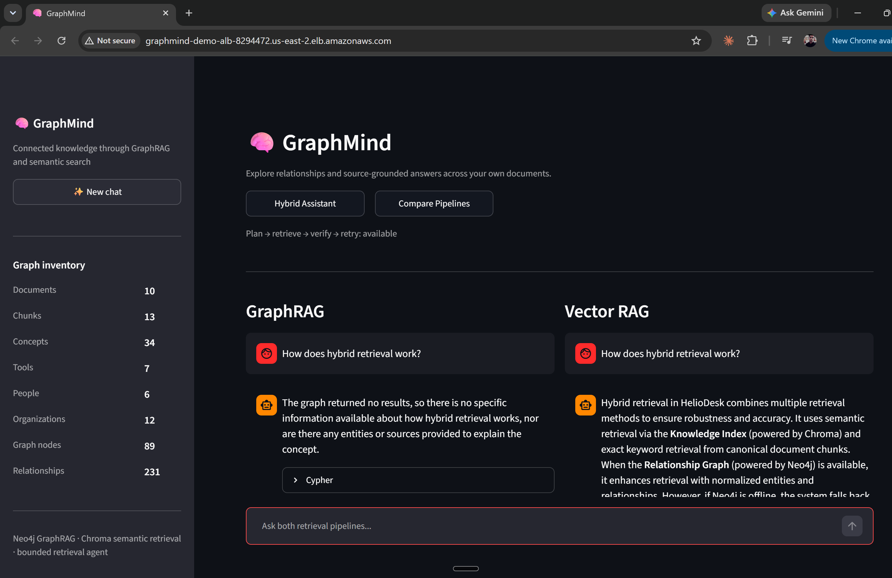
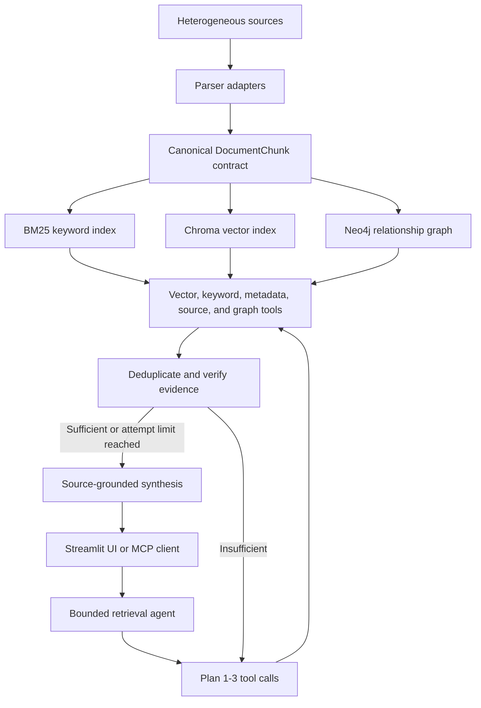
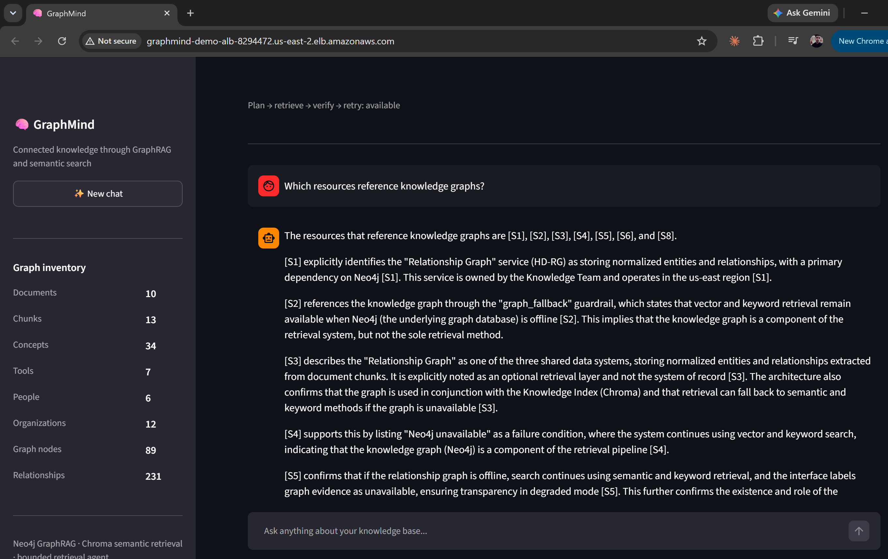
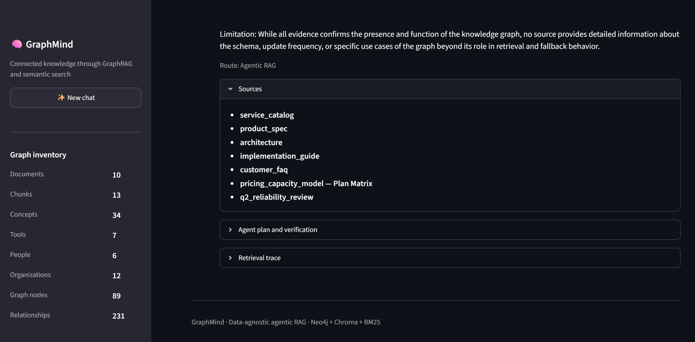
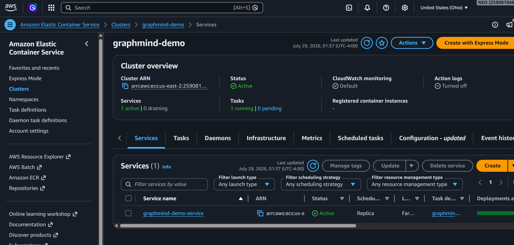
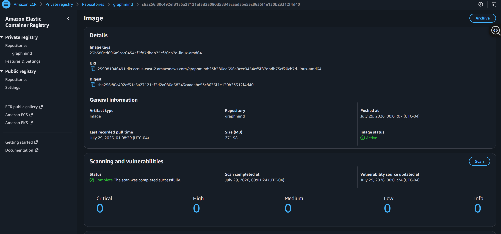

# GraphMind

GraphMind is an extensible agentic RAG engine for heterogeneous documents. It normalizes supported source formats into one canonical contract, builds semantic and graph indexes, plans retrieval across multiple tools, verifies the collected evidence, and retries before producing a cited answer.

> **Selling point:** the retrieval architecture is reusable across datasets. The only bundled sources are a clearly labeled synthetic demo corpus; no customer data or domain-specific schema is hardcoded into the pipeline.

## Demo interface

GraphMind provides a hybrid assistant and a side-by-side comparison of GraphRAG and vector RAG.
The live graph inventory is read from Neo4j rather than hardcoded in the interface.



## What makes it agentic

GraphMind does more than route a question to one retriever:

```text
Question
   ↓
Plan 1–3 retrieval calls
   ↓
Vector + BM25 + Metadata + Source inspection + Graph traversal
   ↓
Deduplicate and combine evidence
   ↓
Verify sufficiency and confidence
   ├── insufficient → replan with another tool and retry
   └── sufficient   → synthesize a cited answer
```

The loop is deliberately bounded to control latency and cost. The response includes the plan, tool trace, evidence count, verification result, confidence, and number of attempts.

## Architecture at a glance



The ingestion and retrieval layers are intentionally decoupled. New source formats implement the
parser contract, new datasets can supply a different ontology, and new retrieval backends implement
the tool interface without changing the agent loop.

## Key engineering decisions

| Decision | Why it matters |
|---|---|
| Canonical `DocumentChunk` contract | Prevents each retriever from depending on source-specific parsing logic |
| Configurable JSON ontology | Adapts graph extraction to a dataset without editing Python |
| Hybrid retrieval | Combines semantic recall, exact matching, metadata filters, source inspection, and graph traversal |
| Bounded plan-verify-retry loop | Adds agency while limiting runaway latency, model usage, and tool calls |
| Evidence-first responses | Exposes citations, source metadata, verification, and retrieval traces |
| Graceful graph fallback | Vector and keyword retrieval remain useful when graph evidence is unavailable |
| Immutable non-root container | Makes the same tested image portable from a laptop to a managed container platform |

### Latency and quality tradeoff

The full agentic path favors evidence quality and inspectability over minimum response time. A
question may require planning, query embedding, optional Cypher generation, evidence verification,
one bounded retry, and final synthesis. These remote calls currently run sequentially. A
latency-sensitive production version could offer a deterministic fast path, parallelize independent
retrievers, and reserve the larger model for final synthesis while retaining this workflow as a
deeper analysis mode.

## Data-agnostic ingestion

Every parser implements the same adapter interface and emits the same `DocumentChunk` model.

Supported MVP formats:

| Adapter | Formats |
|---|---|
| Plain text | `.txt`, `.md`, `.rst`, `.log`, `.yaml`, `.yml` |
| Structured text | `.json`, `.jsonl`, `.csv`, `.tsv` |
| Documents | `.pdf`, `.docx` |
| Spreadsheets | `.xlsx`, `.xlsm` |
| Web exports | `.html`, `.htm` |

The canonical record contains:

```json
{
  "id": "chunk_...",
  "document_id": "...",
  "title": "Architecture",
  "content": "...",
  "source_uri": "engineering/architecture.docx",
  "source_type": "docx",
  "collection": "engineering",
  "content_hash": "...",
  "chunk_index": 0,
  "metadata": {"parser": "DocxParser"},
  "schema_version": "1.0"
}
```

Downstream indexing and retrieval operate only on this contract. Adding a format requires a parser adapter, not changes to the retrieval system.

## Incremental indexing

Ingestion creates a SHA-256 content hash for each source and stores an ingestion manifest. Unchanged sources reuse their existing chunks; changed sources are reparsed; deleted sources disappear from the rebuilt canonical output.

```powershell
python scripts\preprocess_raw_data.py
python scripts\preprocess_raw_data.py --collection engineering
python scripts\preprocess_raw_data.py --force
```

Generated indexes, manifests, source files, credentials, and database content are excluded from Git.

## Bundled multi-format demo

[`demo_data/`](demo_data/) contains a fully fictional HelioDesk corpus across Markdown, CSV, JSON, HTML, DOCX, XLSX, and PDF. The facts connect across files so you can test exact lookup, cross-source synthesis, pricing calculations, incident questions, and later graph relationships without relying on private material.

Ingest it and run a local keyword smoke test:

```powershell
python scripts\bootstrap_demo.py --force
```

This first stage needs neither Neo4j nor model credentials. It creates canonical chunks under `data/processed/` and proves the format adapters and BM25 retrieval path.

## Configurable knowledge graph

The ontology is defined in [`config/default_ontology.json`](config/default_ontology.json), not Python. It controls:

- allowed node labels;
- extractable entity labels;
- allowed relationship types;
- descriptions supplied to extraction and Cypher generation.

Set `ONTOLOGY_PATH` to use a dataset-specific ontology while keeping the architecture unchanged.

## Retrieval tools

| Tool | Best use |
|---|---|
| `vector_search` | Semantic similarity, paraphrases, explanations |
| `keyword_search` | Exact terminology, identifiers, quotations |
| `metadata_search` | Titles, formats, collections, parser metadata |
| `inspect_source` | Ordered reading of a known source |
| `graph_search` | Relationships and multi-hop questions |

The default keyword retriever is a dependency-free BM25 implementation. Vector retrieval uses Chroma, and relationship retrieval uses Neo4j.

## Project structure

```text
GraphMind/
├── config/
│   └── default_ontology.json
├── src/
│   ├── agent/          # plan, retrieve, verify, retry, synthesize
│   ├── graph/          # configurable ontology and Neo4j access
│   ├── ingestion/      # canonical models, parser registry, incremental pipeline
│   ├── retrieval/      # vector, BM25, metadata, source, and graph tools
│   ├── ui/             # Streamlit application
│   └── mcp_server.py   # agent and direct retrieval tools over MCP
├── scripts/
├── tests/
├── .env.example
└── requirements.txt
```

## Setup

```powershell
python -m venv venv
.\venv\Scripts\Activate.ps1
pip install -r requirements.txt
Copy-Item .env.example .env
```

Configure credentials in `.env` only for the layers you want to run.

The recommended order is:

1. **No external services:** ingest sources and test keyword/metadata/source inspection.
2. **Model credentials, no Neo4j:** build Chroma embeddings and test semantic retrieval.
3. **Model credentials plus Neo4j:** extract entities and relationships, write them to Neo4j, and enable graph retrieval.

Neo4j is therefore required only at step 3. Connect it after canonical ingestion and local retrieval are working, immediately before running the graph extraction command with `--write-neo4j`.

Place authorized source documents under `data/raw/`, then run:

```powershell
python scripts\preprocess_raw_data.py
python scripts\extract_graph_from_processed.py --write-neo4j --clear
python -c "from src.retrieval.vector_rag import build_vector_store; build_vector_store()"
```

Start the UI:

```powershell
streamlit run src\ui\app.py
```

## Container deployment

GraphMind includes a non-root production container for temporary staging deployments. At startup,
the container processes only the bundled synthetic demo corpus and builds an ephemeral Chroma
index. The Neo4j graph remains an external managed dependency and must be loaded into a dedicated
Neo4j database before deployment.

Build and run the image locally:

```powershell
docker build -t graphmind:local .
docker run --rm -p 8501:8501 --env-file .env graphmind:local
```

Open `http://localhost:8501` and verify the container health endpoint at
`http://localhost:8501/_stcore/health`.

Runtime requirements:

- inject `NEBIUS_API_KEY` and Neo4j credentials through the platform secret manager;
- never copy `.env`, local source data, generated indexes, or credentials into the image;
- allow outbound HTTPS/Bolt traffic to Nebius and the managed Neo4j database;
- allow up to five minutes for the initial synthetic vector-index bootstrap;
- keep model requests bounded with `MODEL_TIMEOUT_SECONDS` and `MODEL_MAX_RETRIES`;
- treat the local Chroma directory as ephemeral and rebuildable.

Set `GRAPHMIND_BOOTSTRAP_DEMO=false` only when the container is supplied with separately managed
processed and vector indexes.

## AWS deployment evidence

GraphMind was validated in a temporary AWS staging environment using:

- an immutable, commit-tagged image in Amazon ECR;
- a non-root distroless Python runtime;
- Amazon ECS Fargate behind an Application Load Balancer;
- AWS Secrets Manager for Nebius and Neo4j runtime credentials;
- CloudWatch Logs with bounded retention;
- Neo4j Aura as the managed relationship graph.

The deployment ran one health-checked Fargate task and served the synthetic demo corpus through the
same agentic retrieval workflow used locally. After the demo was recorded, the public endpoint,
Fargate service, load balancer, security groups, logs, secret, ECR repository, task definitions, and
temporary IAM policies were intentionally removed. The screenshots are retained as deployment
evidence without leaving billable staging infrastructure running.

### Validated staging results

| Check | Observed result |
|---|---|
| Public health endpoint | `200 OK` from `/_stcore/health` |
| ECS service | 1 desired task, 1 running task, steady deployment |
| Deployed graph inventory | 89 nodes and 231 relationships |
| Deployed document inventory | 10 documents and 13 chunks |
| Container identity | Non-root distroless runtime |
| ECR basic scan | 0 critical, high, medium, low, or informational findings at scan time |
| End-to-end query | Public UI returned a cited answer with sources, verification, and retrieval trace |
| Teardown | Named AWS resources deleted and temporary deployment permissions detached |

### Source-grounded Agentic RAG

The deployed assistant retrieves across the synthetic corpus, cites supporting sources, and states
limitations when the available evidence is incomplete.



### Inspectable evidence and verification

Each response exposes its source list, agent plan, verification result, and retrieval trace.



### ECS Fargate service

The staging cluster reached a steady state with one active service and one running task.



### Container security scan

The final distroless image completed its Amazon ECR scan with zero critical, high, medium, low, or
informational findings at scan time.



The captured endpoint used HTTP for a short-lived demonstration. A persistent production deployment
should add an authenticated access layer and terminate HTTPS with an ACM certificate.

## MCP server

```powershell
python -m src.mcp_server
```

Primary tools:

- `ask_graphmind` — planned and verified multi-tool retrieval
- `search_knowledge_base` — direct semantic retrieval
- `search_keywords` — direct BM25 retrieval
- `search_metadata` — source discovery and filtering
- `inspect_source` — ordered source reading
- `query_knowledge_graph` — natural-language GraphRAG
- `run_readonly_cypher` — guarded Cypher
- `knowledge_stats` — collections, source types, and index inventory

## Tests

```powershell
python -m unittest discover -s tests -v
```

Tests cover parser registration, canonical records, incremental ingestion, HTML cleaning, BM25 ranking, ontology validation, and the agent workflow.

For cross-dataset evaluation, copy `evaluation/questions.example.json`, add questions and expected terms for each corpus, and run:

```powershell
python scripts\evaluate_agent.py --dataset evaluation\questions.example.json
```

The bundled corpus already has a six-question set at `evaluation/heliodesk_demo.json`.

The JSON report records sufficiency rate, grounded-answer rate, confidence, lexical term recall, latency, attempts, plans, and tool traces. Run the same harness against unrelated collections to demonstrate that performance comes from the architecture rather than one dataset.

## Honest scope

GraphMind is an architecture-focused MVP, not a claim of universal ingestion or production-scale infrastructure.

Current limitations:

- no OCR for scanned PDFs or images;
- no live website, API, SQL, or cloud-storage connectors;
- local synchronous ingestion rather than a distributed task queue;
- local Chroma and Neo4j defaults rather than managed multi-tenant infrastructure;
- model-provider configuration currently follows the OpenAI-compatible Nebius interface.

The parser registry, canonical contract, collection isolation, content hashing, configurable ontology, and retrieval-tool interface provide clean extension points for those capabilities.

## Privacy

Only code, example configuration, and the explicitly synthetic files in `demo_data/` belong in this repository. Do not commit private source documents, processed chunks, vector stores, database exports, or `.env` credentials. Confirm that you have permission to process every non-demo source.

## License

MIT — see [LICENSE](LICENSE).
